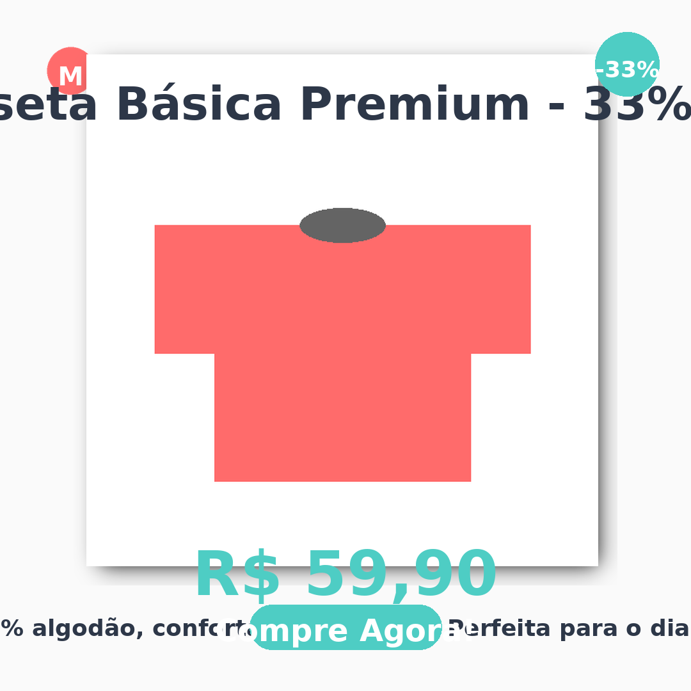
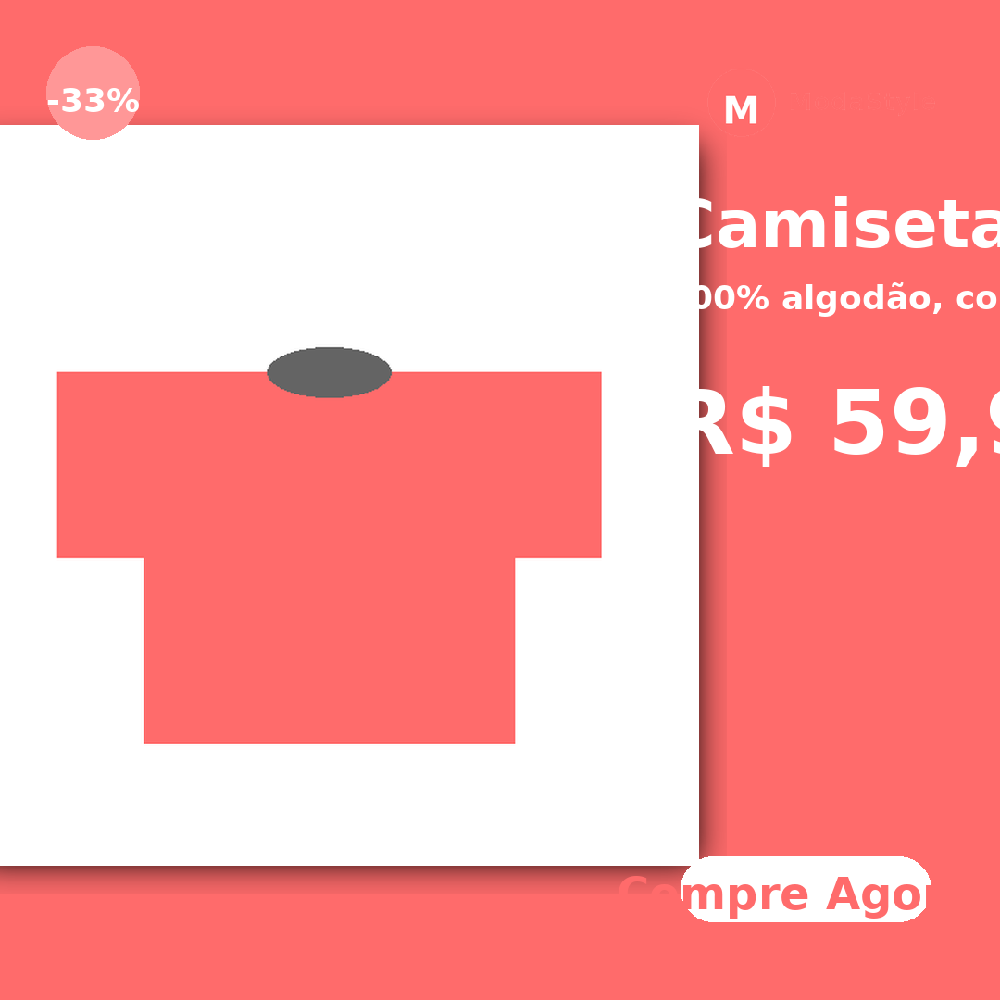
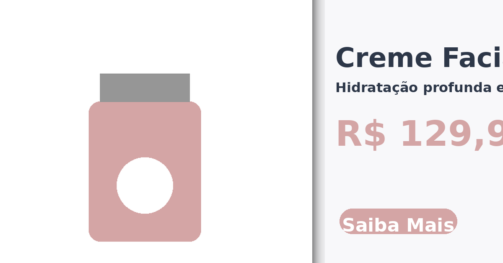

# 🌐 Como Publicar e Compartilhar o Projeto no GitHub

## Opção 1: Criar Pull Request (Recomendado)

### Passo 1: Acessar o Repositório no GitHub

Acesse seu repositório no GitHub:
```
https://github.com/baciclucas/social-media-gen
```

### Passo 2: Criar um Pull Request

1. No GitHub, você verá uma notificação sobre o branch recente:
   ```
   claude/ecommerce-creative-generator-xiixe had recent pushes
   ```

2. Clique em **"Compare & pull request"**

3. Ou acesse diretamente:
   ```
   https://github.com/baciclucas/social-media-gen/compare/claude/ecommerce-creative-generator-xiixe
   ```

4. Preencha o título e descrição do PR com o conteúdo abaixo

### Título do PR:
```
🎨 POC: Gerador Automático de Criativos de Mídia para E-commerce
```

### Descrição do PR:
```markdown
## 📋 Resumo

POC completa de um sistema gerador automático de criativos profissionais para micro e pequenos varejistas divulgarem produtos em redes sociais e mídia paga.

## ✨ Funcionalidades

- 🎨 Geração automática de 8 criativos (2 variações × 4 formatos)
- 📱 Interface web mobile-first desenvolvida com Streamlit
- 🖼️ Processamento inteligente de logos e produtos
- 🎨 Harmonização automática de cores
- 🤖 Geração de textos persuasivos com Claude AI
- 📐 Templates minimalistas e vibrantes
- ✅ Validação de contraste para legibilidade
- 💾 Exportação em alta qualidade (PNG 95%)

## 🎯 Formatos Gerados

1. **Instagram Feed** (1080x1080) - 2 variações
2. **Instagram Story** (1080x1920) - 2 variações
3. **Facebook Ads** (1200x628) - 2 variações
4. **Web Banner** (1200x400) - 2 variações

## 📱 Interface Web

- Design mobile-first totalmente responsivo
- Upload de imagens por drag-and-drop
- Seletores de cor visuais
- Preview em tempo real
- Download individual ou em ZIP
- Organização em tabs por formato

## 🚀 Como Usar

### CLI:
```bash
python -m src.main assets/examples/test_case_1_moda.json
```

### Interface Web:
```bash
streamlit run app.py
```

## 📊 Performance

- ✅ Tempo médio: ~0.6s por caso (8 criativos)
- ✅ Total: 24 criativos gerados em 1.8s
- ✅ Muito abaixo do objetivo de 60s

## 🎉 Critérios de Sucesso

- ✅ Sistema gera os 8 criativos corretamente
- ✅ Tempo de processamento < 60 segundos
- ✅ Criativos mantêm identidade visual da marca
- ✅ Textos são contextualmente relevantes
- ✅ Layout é profissional e balanceado
- ✅ Código é modular e extensível
- ✅ Interface mobile-first funcional

## 📁 Estrutura do Projeto

```
src/
├── main.py                  # Orquestração principal
├── config.py               # Configurações e constantes
├── processors/             # Processamento de imagens, cores, textos
├── templates/              # Templates para cada formato
└── utils/                  # Funções auxiliares

app.py                      # Interface web Streamlit
assets/examples/            # 3 casos de teste completos
output/                     # Exemplos de criativos gerados
```

## 📚 Documentação

- [README.md](README.md) - Documentação completa
- [QUICK_START_WEB.md](QUICK_START_WEB.md) - Guia rápido da interface
- [COMO_USAR_INTERFACE.md](COMO_USAR_INTERFACE.md) - Tutorial visual passo a passo
- [INTERFACE_FEATURES.md](INTERFACE_FEATURES.md) - Recursos técnicos detalhados

## 🧪 Casos de Teste

Incluídos 3 casos de teste completos com assets:
1. **Moda** - Camiseta com 33% desconto
2. **Beleza** - Creme facial sem desconto
3. **Eletrônicos** - Fone Bluetooth com 40% desconto

## 📸 Screenshots

Veja os criativos gerados em `output/` com exemplos reais dos 3 casos de teste.

## 🔧 Tecnologias

- Python 3.10+
- Pillow (PIL) - Manipulação de imagens
- Streamlit - Interface web
- Anthropic Claude API - Geração de textos
- Type hints e docstrings completas
- PEP 8 compliance

## 🎯 Próximos Passos

- [ ] PWA (Progressive Web App)
- [ ] Remoção avançada de background com rembg
- [ ] Histórico de gerações
- [ ] Compartilhamento direto nas redes sociais
- [ ] Modo escuro/claro

---

**Desenvolvido para Komea - Rede de Agentes de IA da Loja Integrada**
```

5. Clique em **"Create pull request"**

---

## Opção 2: Compartilhar Link Direto do Branch

Você pode compartilhar o link direto do seu branch:

```
https://github.com/baciclucas/social-media-gen/tree/claude/ecommerce-creative-generator-xiixe
```

Neste link, qualquer pessoa pode:
- Ver todo o código
- Navegar pelos arquivos
- Ler a documentação
- Ver os commits

---

## Opção 3: GitHub Pages (Para Interface Web)

### Se quiser hospedar a interface web:

1. **Opção A: Streamlit Cloud (Recomendado)**

   Acesse: https://streamlit.io/cloud

   - Conecte seu repositório GitHub
   - Selecione `app.py` como arquivo principal
   - Deploy automático!
   - Você receberá uma URL tipo: `https://seu-app.streamlit.app`

2. **Opção B: Heroku**

   Crie um `Procfile`:
   ```
   web: streamlit run app.py --server.port=$PORT --server.address=0.0.0.0
   ```

   Deploy:
   ```bash
   heroku create seu-app
   git push heroku claude/ecommerce-creative-generator-xiixe:main
   ```

3. **Opção C: Railway.app**

   - Conecte seu GitHub
   - Selecione o repositório
   - Deploy automático!

---

## Opção 4: Criar README.md com Preview de Imagens

Se você quiser que as pessoas vejam os criativos gerados diretamente no GitHub:

1. Faça upload de algumas imagens geradas para o GitHub
2. Adicione no README.md:

```markdown
## 📸 Exemplos de Criativos Gerados

### Caso 1: Moda - Camiseta Premium




### Caso 2: Beleza - Creme Facial



### Caso 3: Eletrônicos - Fone Bluetooth


```

---

## URLs Úteis para Compartilhar

### Repositório:
```
https://github.com/baciclucas/social-media-gen
```

### Branch específico:
```
https://github.com/baciclucas/social-media-gen/tree/claude/ecommerce-creative-generator-xiixe
```

### Arquivo específico (exemplo - README):
```
https://github.com/baciclucas/social-media-gen/blob/claude/ecommerce-creative-generator-xiixe/README.md
```

### Interface web (exemplo - app.py):
```
https://github.com/baciclucas/social-media-gen/blob/claude/ecommerce-creative-generator-xiixe/app.py
```

### Comparação de mudanças:
```
https://github.com/baciclucas/social-media-gen/compare/claude/ecommerce-creative-generator-xiixe
```

---

## 📱 Demo Online Rápido

Para uma demo rápida sem deploy:

1. **Usando ngrok:**
   ```bash
   # Instale ngrok
   npm install -g ngrok

   # Inicie o Streamlit
   streamlit run app.py

   # Em outro terminal, crie túnel
   ngrok http 8501
   ```

   Você receberá uma URL pública temporária!

2. **Usando localtunnel:**
   ```bash
   # Instale localtunnel
   npm install -g localtunnel

   # Inicie o Streamlit
   streamlit run app.py

   # Em outro terminal
   lt --port 8501
   ```

---

## 🎬 Criar Vídeo Demo

Para impressionar ainda mais:

1. Grave um vídeo curto (30-60s) usando a interface
2. Faça upload no YouTube
3. Adicione no README:
   ```markdown
   ## 🎥 Vídeo Demonstração

   [](https://youtube.com/seu-video)
   ```

---

## 📊 Estatísticas do Projeto

Para adicionar badges no README:

```markdown


```

---

## 🤝 Convidar Colaboradores

Depois de criar o PR, você pode:

1. Compartilhar a URL do PR
2. Pedir review de outras pessoas
3. Fazer merge quando aprovado
4. Criar releases/tags para versões

---

## ✅ Checklist de Publicação

- [ ] Criar Pull Request
- [ ] Adicionar descrição detalhada
- [ ] Incluir screenshots/exemplos
- [ ] Testar links da documentação
- [ ] Verificar se README está completo
- [ ] Adicionar badges (opcional)
- [ ] Criar release/tag (opcional)
- [ ] Deploy da interface web (opcional)
- [ ] Compartilhar URL com stakeholders

---

**Pronto! Agora seu projeto está visível e compartilhável! 🎉**
